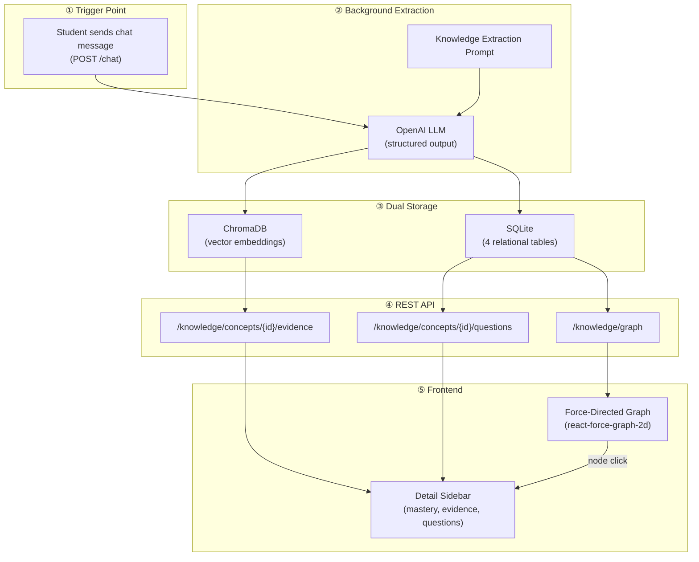
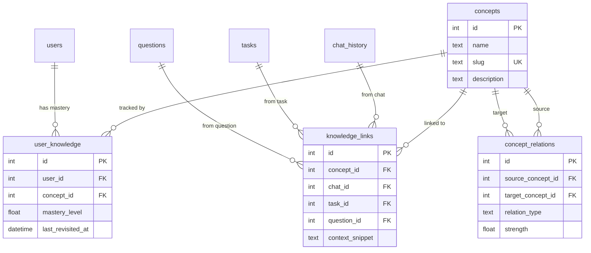

# Neural Knowledge Map — Complete Integration Guide

> **Purpose**: This document provides your friend with everything needed to replicate the Neural Knowledge Map feature in a separate Knowledge Hub repo. It covers the full data pipeline end-to-end: from how concepts are extracted during chat, to how they're stored, queried, and visualized.

---

## Table of Contents

1. [Architecture Overview](#1-architecture-overview)
2. [Database Schema (SQLite)](#2-database-schema-sqlite)
3. [Vector Store (ChromaDB)](#3-vector-store-chromadb)
4. [LLM Extraction Pipeline](#4-llm-extraction-pipeline)
5. [Backend API Endpoints](#5-backend-api-endpoints)
6. [Frontend Visualization](#6-frontend-visualization)
7. [End-to-End Data Flow](#7-end-to-end-data-flow)
8. [Step-by-Step Integration Checklist](#8-step-by-step-integration-checklist)
9. [Dependencies](#9-dependencies)

---

## 1. Architecture Overview

The Neural Knowledge Map is a **dual-database system** that automatically extracts educational concepts from student-AI conversations and visualizes them as a force-directed graph.



### Key Design Decisions

| Decision | Rationale |
|---|---|
| **SQLite** for relational data | Concepts, mastery levels, and links need joins and structured queries |
| **ChromaDB** for evidence | Q&A snippets need semantic similarity search via vector embeddings |
| **Background task** for extraction | LLM calls are slow (~2-5s); we don't block the chat response |
| **`react-force-graph-2d`** for visualization | Hardware-accelerated Canvas rendering, physics simulation built-in |
| **Mastery is additive** | Each concept encounter adds +0.1 mastery, capped at 1.0 |

---

## 2. Database Schema (SQLite)

Four tables power the relational side. Create them in your DB initialization:

### Table 1: `concepts` — The nodes of the graph

```sql
CREATE TABLE IF NOT EXISTS concepts (
    id INTEGER PRIMARY KEY AUTOINCREMENT,
    name TEXT NOT NULL,              -- Human-readable: "Closures in JavaScript"
    slug TEXT NOT NULL UNIQUE,       -- URL-friendly: "closure-js"
    description TEXT,                -- LLM-generated summary of what was learned
    created_at DATETIME DEFAULT CURRENT_TIMESTAMP,
    updated_at DATETIME DEFAULT CURRENT_TIMESTAMP,
    deleted_at DATETIME              -- Soft delete
);
CREATE INDEX IF NOT EXISTS idx_concept_slug ON concepts (slug);
```

### Table 2: `user_knowledge` — Per-user mastery tracking

```sql
CREATE TABLE IF NOT EXISTS user_knowledge (
    id INTEGER PRIMARY KEY AUTOINCREMENT,
    user_id INTEGER NOT NULL,
    concept_id INTEGER NOT NULL,
    mastery_level FLOAT DEFAULT 0.0, -- Range: 0.0 to 1.0
    last_revisited_at DATETIME DEFAULT CURRENT_TIMESTAMP,
    created_at DATETIME DEFAULT CURRENT_TIMESTAMP,
    updated_at DATETIME DEFAULT CURRENT_TIMESTAMP,
    deleted_at DATETIME,
    UNIQUE(user_id, concept_id),     -- One mastery record per user per concept
    FOREIGN KEY (user_id) REFERENCES users(id) ON DELETE CASCADE,
    FOREIGN KEY (concept_id) REFERENCES concepts(id) ON DELETE CASCADE
);
CREATE INDEX IF NOT EXISTS idx_user_knowledge_user_id ON user_knowledge (user_id);
```

### Table 3: `knowledge_links` — Connects concepts to artifacts

This is the **join table** that links a concept back to the specific chat, task, and question where it was encountered.

```sql
CREATE TABLE IF NOT EXISTS knowledge_links (
    id INTEGER PRIMARY KEY AUTOINCREMENT,
    concept_id INTEGER NOT NULL,
    chat_id INTEGER,                 -- Which chat message produced this concept
    task_id INTEGER,                 -- Which curriculum task (assignment/quiz)
    question_id INTEGER,             -- Which specific question within the task
    context_snippet TEXT,            -- Brief description from the LLM
    created_at DATETIME DEFAULT CURRENT_TIMESTAMP,
    FOREIGN KEY (concept_id) REFERENCES concepts(id) ON DELETE CASCADE,
    FOREIGN KEY (chat_id) REFERENCES chat_history(id) ON DELETE CASCADE,
    FOREIGN KEY (task_id) REFERENCES tasks(id) ON DELETE CASCADE,
    FOREIGN KEY (question_id) REFERENCES questions(id) ON DELETE CASCADE
);
CREATE INDEX IF NOT EXISTS idx_knowledge_link_concept_id ON knowledge_links (concept_id);
```

### Table 4: `concept_relations` — The edges of the graph

```sql
CREATE TABLE IF NOT EXISTS concept_relations (
    id INTEGER PRIMARY KEY AUTOINCREMENT,
    source_concept_id INTEGER NOT NULL,
    target_concept_id INTEGER NOT NULL,
    relation_type TEXT NOT NULL,      -- e.g., "related_to", "prerequisite_of"
    strength FLOAT DEFAULT 1.0,      -- Edge weight
    created_at DATETIME DEFAULT CURRENT_TIMESTAMP,
    UNIQUE(source_concept_id, target_concept_id, relation_type),
    FOREIGN KEY (source_concept_id) REFERENCES concepts(id) ON DELETE CASCADE,
    FOREIGN KEY (target_concept_id) REFERENCES concepts(id) ON DELETE CASCADE
);
CREATE INDEX IF NOT EXISTS idx_concept_relation_source ON concept_relations (source_concept_id);
CREATE INDEX IF NOT EXISTS idx_concept_relation_target ON concept_relations (target_concept_id);
```

### Entity Relationship Diagram



---

## 3. Vector Store (ChromaDB)

ChromaDB stores the **Q&A evidence** — the exact question-answer pairs that prove a student discussed a concept. This enables semantic retrieval later.

### Setup

```python
import chromadb
from chromadb.utils import embedding_functions
import os

class VectorDB:
    """Singleton wrapper around ChromaDB for knowledge evidence."""
    _instance = None

    def __new__(cls):
        if cls._instance is None:
            cls._instance = super(VectorDB, cls).__new__(cls)
            cls._instance._initialized = False
        return cls._instance

    def __init__(self):
        if self._initialized:
            return

        # Persistent storage on disk
        db_path = os.path.join(os.path.dirname(__file__), "..", "..", "db", "chroma")
        os.makedirs(db_path, exist_ok=True)

        self.client = chromadb.PersistentClient(path=db_path)

        # Use OpenAI's small embedding model (cheap and fast)
        self.embedding_fn = embedding_functions.OpenAIEmbeddingFunction(
            api_key=os.getenv("OPENAI_API_KEY"),
            model_name="text-embedding-3-small"
        )

        # Single collection for all evidence
        self.knowledge_collection = self.client.get_or_create_collection(
            name="knowledge_evidence",
            embedding_function=self.embedding_fn,
            metadata={"hnsw:space": "cosine"}  # Cosine similarity
        )

        self._initialized = True

    async def add_evidence(self, concept_id: int, user_id: int, text: str, metadata: dict = None):
        """Store a Q&A evidence snippet for a concept."""
        doc_id = f"c_{concept_id}_u_{user_id}_{hash(text)}"
        self.knowledge_collection.add(
            documents=[text],
            metadatas=[{
                "concept_id": concept_id,
                "user_id": user_id,
                **(metadata or {})
            }],
            ids=[doc_id]
        )

    async def get_evidence(self, concept_id: int, user_id: int, limit: int = 5):
        """Retrieve evidence for a concept, filtered by user."""
        results = self.knowledge_collection.query(
            query_texts=[""],  # Empty query — we filter by metadata
            where={
                "$and": [
                    {"concept_id": {"$eq": concept_id}},
                    {"user_id": {"$eq": user_id}}
                ]
            },
            n_results=limit
        )

        evidence = []
        if results['documents']:
            for i in range(len(results['documents'][0])):
                evidence.append({
                    "content": results['documents'][0][i],
                    "metadata": results['metadatas'][0][i]
                })
        return evidence

# Singleton instance
vector_db = VectorDB()
```

### What gets stored in ChromaDB

Each document is a string formatted as:
```
Q: What is a closure? A: A closure is a function that retains access to variables from its enclosing scope...
```

The metadata includes `concept_id`, `user_id`, `task_id`, `question_id`, and `chat_id` for cross-referencing.

---

## 4. LLM Extraction Pipeline

This is the **brain** of the system. It runs as a **background task** after every chat message batch is stored.

### 4a. The Prompt

```python
from pydantic import BaseModel
from typing import List, Optional

class ExtractedConcept(BaseModel):
    name: str                                  # "Closures in JavaScript"
    slug: str                                  # "closure-js"
    description: str                           # Brief summary of what was learned
    evidence: str                              # "Q: What is a closure? A: ..."
    relation_to_previous: Optional[str] = None
    related_to_slugs: List[str] = []           # ["functions-js", "scope-js"]

class KnowledgeExtractionResponse(BaseModel):
    concepts: List[ExtractedConcept]

KNOWLEDGE_EXTRACTION_PROMPT = """
Analyze the following conversation between a student and an AI tutor.
Extract the core educational concepts discussed.

For each concept:
1. Provide a clear, concise name.
2. Create a unique URL-friendly 'slug' (e.g., 'closure-js').
3. Write a brief description of what was learned about this concept.
4. Provide 'evidence': The most relevant Question + Answer pair from the transcript
   that demonstrates the learning of this concept.
   Format it as "Q: [Question] A: [Answer]".
5. Identify how it relates to other concepts mentioned in this or previous discussions.

Focus on atomic concepts that are reusable across different modules.

Conversation:
{conversation_text}

Output should be a structured list of concepts.
"""
```

### 4b. The Extraction Function

This is triggered as a **BackgroundTask** from the chat endpoint.

```python
async def extract_and_link_knowledge(
    user_id: int,
    chat_messages: List[dict],     # [{"role": "user", "content": "..."}, ...]
    chat_ids: List[int],           # DB IDs of the stored chat messages
    task_id: Optional[int] = None,
    question_id: Optional[int] = None
):
    try:
        # Step 1: Format the conversation for the LLM
        conversation_text = ""
        for msg in chat_messages:
            role = "Student" if msg["role"] == "user" else "Tutor"
            conversation_text += f"{role}: {msg['content']}\n"

        # Step 2: Call OpenAI with structured output (Pydantic model)
        messages = [
            {"role": "system", "content": "You are a knowledge engineering assistant."},
            {"role": "user", "content": KNOWLEDGE_EXTRACTION_PROMPT.format(
                conversation_text=conversation_text
            )}
        ]

        extraction_result = await run_llm_with_openai(
            model="gpt-4o-mini",      # Use a smaller/cheaper model for extraction
            messages=messages,
            response_model=KnowledgeExtractionResponse,
            max_output_tokens=2000
        )

        # Step 3: Process each extracted concept
        for concept in extraction_result.concepts:

            # 3a. Upsert the concept (INSERT or UPDATE if slug exists)
            concept_id = await upsert_concept(
                name=concept.name,
                slug=concept.slug,
                description=concept.description
            )

            # 3b. Update user mastery (+0.1 per encounter, max 1.0)
            await update_user_knowledge(user_id, concept_id, mastery_delta=0.1)

            # 3c. Store Q&A evidence in ChromaDB
            if concept.evidence:
                await vector_db.add_evidence(
                    concept_id=concept_id,
                    user_id=user_id,
                    text=concept.evidence,
                    metadata={
                        "task_id": task_id,
                        "question_id": question_id,
                        "chat_id": chat_ids[-1] if chat_ids else None
                    }
                )

            # 3d. Create the knowledge link (concept → chat/task/question)
            if chat_ids:
                await create_knowledge_link(
                    concept_id=concept_id,
                    chat_id=chat_ids[-1],
                    task_id=task_id,
                    question_id=question_id,
                    context_snippet=concept.description
                )

            # 3e. Create edges to related concepts
            for related_slug in concept.related_to_slugs:
                related_concept = await get_concept_by_slug(related_slug)
                if related_concept:
                    await upsert_concept_relation(
                        source_id=concept_id,
                        target_id=related_concept.id,
                        relation_type="related_to"
                    )

    except Exception as e:
        logger.error(f"Error during knowledge extraction: {str(e)}", exc_info=True)
```

### 4c. The Trigger Point (Chat Endpoint)

```python
from fastapi import APIRouter, BackgroundTasks

@router.post("/")
async def store_messages(request: StoreMessagesRequest, background_tasks: BackgroundTasks):
    # 1. Store the chat messages in SQLite
    messages = await store_messages_in_db(
        messages=request.messages,
        user_id=request.user_id,
        question_id=request.question_id,
        task_id=request.task_id,
    )

    # 2. Fire-and-forget: extract knowledge in background
    if messages:
        background_tasks.add_task(
            extract_and_link_knowledge,
            user_id=request.user_id,
            chat_messages=[{"role": m.role, "content": m.content} for m in request.messages],
            chat_ids=[m["id"] for m in messages],
            task_id=request.task_id,
            question_id=request.question_id
        )

    return messages
```

> [!IMPORTANT]
> The key insight is that `background_tasks.add_task()` runs AFTER the HTTP response is sent. The student gets instant chat responses — knowledge extraction happens invisibly in the background.

---

## 5. Backend API Endpoints

Six REST endpoints serve the knowledge data. Mount them under `/knowledge`.

### Endpoint Summary

| Method | Path | Purpose | Returns |
|---|---|---|---|
| `GET` | `/knowledge/graph?user_id=X` | Full graph for a user | `{nodes: [...], edges: [...]}` |
| `GET` | `/knowledge/concepts/{id}/evidence?user_id=X` | Q&A evidence for a concept | `[{content, metadata}]` |
| `GET` | `/knowledge/concepts/{id}/questions?user_id=X` | Questions user faced for a concept | `[{id, title, type, task_id}]` |
| `GET` | `/knowledge/concepts` | All concepts (admin) | `[{id, name, slug, description}]` |
| `POST` | `/knowledge/concepts` | Create/update a concept | `concept_id` |
| `POST` | `/knowledge/relations` | Create/update a relation | `{status: "success"}` |

### Graph Endpoint — The Main Query

This is the most complex query. It fetches all concepts for a user, their mastery levels, and the most recent task/question IDs linked to each concept:

```python
async def get_user_knowledge_graph(user_id: int) -> Dict:
    query = """
    SELECT DISTINCT c.id, c.name, c.slug, c.description, uk.mastery_level,
           -- Subquery: Get the latest task_id linked to this concept
           (SELECT task_id FROM knowledge_links kl
            WHERE kl.concept_id = c.id AND kl.task_id IS NOT NULL
            ORDER BY kl.created_at DESC LIMIT 1) as latest_task_id,
           -- Subquery: Get the latest question_id linked to this concept
           (SELECT question_id FROM knowledge_links kl
            WHERE kl.concept_id = c.id AND kl.question_id IS NOT NULL
            ORDER BY kl.created_at DESC LIMIT 1) as latest_question_id
    FROM concepts c
    INNER JOIN user_knowledge uk ON c.id = uk.concept_id
    WHERE uk.user_id = ? AND c.deleted_at IS NULL
    """
    nodes = await execute_db_operation(query, (user_id,), fetch_all=True)

    node_ids = [node[0] for node in nodes]
    if not node_ids:
        return {"nodes": [], "edges": []}

    # Fetch edges between these nodes only
    placeholders = ",".join(["?"] * len(node_ids))
    query_rels = f"""
    SELECT source_concept_id, target_concept_id, relation_type, strength
    FROM concept_relations
    WHERE source_concept_id IN ({placeholders})
      AND target_concept_id IN ({placeholders})
    """
    edges = await execute_db_operation(query_rels, node_ids + node_ids, fetch_all=True)

    return {
        "nodes": [
            {
                "id": n[0], "name": n[1], "slug": n[2],
                "description": n[3], "mastery": n[4],
                "task_id": n[5], "question_id": n[6]
            }
            for n in nodes
        ],
        "edges": [
            {"source": e[0], "target": e[1], "type": e[2], "strength": e[3]}
            for e in edges
        ]
    }
```

### Questions Endpoint — New Feature

Fetches the actual quiz questions a user encountered that are linked to a concept:

```python
async def get_concept_questions_for_user(concept_id: int, user_id: int) -> List[Dict]:
    query = """
    SELECT DISTINCT q.id, q.title, q.type, q.task_id
    FROM questions q
    INNER JOIN knowledge_links kl ON q.id = kl.question_id
    INNER JOIN chat_history ch ON kl.chat_id = ch.id
    WHERE kl.concept_id = ? AND ch.user_id = ? AND q.deleted_at IS NULL
    """
    rows = await execute_db_operation(query, (concept_id, user_id), fetch_all=True)
    return [{"id": row[0], "title": row[1], "type": row[2], "task_id": row[3]} for row in rows]
```

### API Response Shapes

**`GET /knowledge/graph?user_id=1`**
```json
{
  "nodes": [
    {
      "id": 1,
      "name": "Closures",
      "slug": "closures-js",
      "description": "Functions that retain access to their enclosing scope",
      "mastery": 0.7,
      "task_id": 4,
      "question_id": 12
    }
  ],
  "edges": [
    { "source": 1, "target": 2, "type": "related_to", "strength": 1.0 }
  ]
}
```

**`GET /knowledge/concepts/1/evidence?user_id=1`**
```json
[
  {
    "content": "Q: What is a closure in JavaScript? A: A closure is a function that has access to variables from its outer lexical scope...",
    "metadata": { "concept_id": 1, "user_id": 1, "task_id": 4, "question_id": 12 }
  }
]
```

**`GET /knowledge/concepts/1/questions?user_id=1`**
```json
[
  { "id": 12, "title": "Explain closures in JavaScript", "type": "subjective", "task_id": 4 },
  { "id": 15, "title": "What is the output of foo()?", "type": "objective", "task_id": 4 }
]
```

---

## 6. Frontend Visualization

### 6a. Dependencies

```bash
npm install react-force-graph-2d d3-force
npm install -D @types/d3-force  # if using TypeScript
```

### 6b. API Hooks (TypeScript)

Three React hooks fetch data from the backend:

```typescript
// --- Interfaces ---
export interface KnowledgeNode {
  id: number;
  name: string;
  slug: string;
  description?: string;
  mastery?: number;
  task_id?: number;
  question_id?: number;
}

export interface KnowledgeEdge {
  source: number;
  target: number;
  type: string;
  strength: number;
}

export interface KnowledgeGraphData {
  nodes: KnowledgeNode[];
  edges: KnowledgeEdge[];
}

export interface ConceptQuestion {
  id: number;
  title: string;
  type: string;      // "subjective" | "objective"
  task_id: number;
}

// --- Hook 1: Fetch the full graph ---
export function useKnowledgeGraph() {
  const { user } = useAuth();
  const [data, setData] = useState<KnowledgeGraphData | null>(null);
  const [isLoading, setIsLoading] = useState(true);

  useEffect(() => {
    if (!user?.id) return;
    fetch(`${API_URL}/knowledge/graph?user_id=${user.id}`)
      .then(r => r.json())
      .then(setData)
      .finally(() => setIsLoading(false));
  }, [user?.id]);

  return { data, isLoading };
}

// --- Hook 2: Fetch evidence for a selected node ---
export function useKnowledgeEvidence(conceptId: number | null) {
  const { user } = useAuth();
  const [evidence, setEvidence] = useState<any[]>([]);

  useEffect(() => {
    if (!user?.id || !conceptId) { setEvidence([]); return; }
    fetch(`${API_URL}/knowledge/concepts/${conceptId}/evidence?user_id=${user.id}`)
      .then(r => r.json())
      .then(setEvidence);
  }, [conceptId, user?.id]);

  return { evidence };
}

// --- Hook 3: Fetch questions for a selected node ---
export function useConceptQuestions(conceptId: number | null) {
  const { user } = useAuth();
  const [questions, setQuestions] = useState<ConceptQuestion[]>([]);

  useEffect(() => {
    if (!user?.id || !conceptId) { setQuestions([]); return; }
    fetch(`${API_URL}/knowledge/concepts/${conceptId}/questions?user_id=${user.id}`)
      .then(r => r.json())
      .then(setQuestions);
  }, [conceptId, user?.id]);

  return { questions };
}
```

### 6c. Graph Component (`KnowledgeGraph.tsx`)

The graph uses `react-force-graph-2d` with **custom Canvas rendering** for nodes:

```tsx
import dynamic from 'next/dynamic';
import { forceCollide } from 'd3-force';

// SSR-safe dynamic import (react-force-graph-2d uses window)
const ForceGraph2D = dynamic(() => import('react-force-graph-2d'), { ssr: false });

const KnowledgeGraph = ({ data, onNodeClick }) => {
  const fgRef = useRef(null);
  const isDark = /* your theme detection */;

  // Transform data for the graph library
  const graphData = useMemo(() => ({
    nodes: data.nodes.map(n => ({ ...n })),
    links: data.edges.map(e => ({ ...e }))
  }), [data]);

  // Configure physics forces
  useEffect(() => {
    if (fgRef.current) {
      fgRef.current.d3Force('charge').strength(-600);
      fgRef.current.d3Force('link').distance(160).strength(0.5);
      fgRef.current.d3Force('center').strength(0.8);
      fgRef.current.d3Force('collide', forceCollide(30));
    }
  }, [graphData]);

  return (
    <ForceGraph2D
      ref={fgRef}
      graphData={graphData}
      onNodeClick={(node) => onNodeClick?.(node)}
      nodeCanvasObject={(node, ctx, globalScale) => {
        const mastery = node.mastery || 0;
        const size = mastery * 4 + 5; // Min 5px, max 9px radius

        // 1. Mastery progress ring
        ctx.beginPath();
        ctx.arc(node.x, node.y, size + 2, -Math.PI/2, -Math.PI/2 + 2*Math.PI*mastery);
        ctx.strokeStyle = mastery > 0.7 ? '#10b981' : mastery > 0.3 ? '#0d9488' : '#64748b';
        ctx.lineWidth = 2;
        ctx.stroke();

        // 2. Main node circle with gradient
        const gradient = ctx.createRadialGradient(node.x, node.y, 0, node.x, node.y, size);
        gradient.addColorStop(0, /* lighter color based on mastery */);
        gradient.addColorStop(1, /* darker color based on mastery */);
        ctx.beginPath();
        ctx.arc(node.x, node.y, size, 0, 2 * Math.PI);
        ctx.fillStyle = gradient;
        ctx.fill();

        // 3. Text label (only when zoomed in)
        if (globalScale > 0.8) {
          ctx.font = `500 ${12/globalScale}px "Inter", sans-serif`;
          ctx.fillStyle = isDark ? '#f8fafc' : '#1e293b';
          ctx.textAlign = 'center';
          ctx.fillText(node.name, node.x, node.y + size + 12);
        }
      }}
      // Edge styling
      linkColor={() => isDark ? 'rgba(20,184,166,0.15)' : 'rgba(0,0,0,0.05)'}
      linkWidth={1.5}
      linkCurvature={0.2}
      linkDirectionalParticles={1}
      linkDirectionalParticleSpeed={0.005}
    />
  );
};
```

> [!TIP]
> The `nodeCanvasObject` callback is where all the visual magic happens. It gives you raw Canvas API access for each node, so you can draw gradients, progress arcs, and labels with full control.

### 6d. Page Component — Sidebar with Questions & Evidence

When a node is clicked, a sidebar opens showing:
1. **Mastery bar** — visual progress indicator
2. **Insight Summary** — LLM-generated description
3. **Questions Faced** — clickable cards linking to the quiz
4. **Evidence** — Q&A snippets from ChromaDB

The sidebar doesn't navigate away — the user stays on the graph and can click individual questions to deep-link.

---

## 7. End-to-End Data Flow

Here is the **complete journey** of a single piece of knowledge, from user input to graph visualization:

```
┌─────────────────────────────────────────────────────────────────────┐
│ 1. STUDENT CHATS DURING A QUIZ                                      │
│                                                                      │
│    Student: "I don't understand closures"                           │
│    Tutor:   "A closure is a function that retains access to..."     │
│                                                                      │
│    → Frontend calls POST /chat with:                                │
│      { user_id: 5, task_id: 4, question_id: 12, messages: [...] }  │
└──────────────────────────┬──────────────────────────────────────────┘
                           │
                           ▼
┌─────────────────────────────────────────────────────────────────────┐
│ 2. CHAT ENDPOINT STORES MESSAGES + TRIGGERS BACKGROUND TASK         │
│                                                                      │
│    a) Messages saved to chat_history table in SQLite                │
│    b) background_tasks.add_task(extract_and_link_knowledge, ...)    │
│    c) HTTP response returned IMMEDIATELY to the student             │
└──────────────────────────┬──────────────────────────────────────────┘
                           │ (async, non-blocking)
                           ▼
┌─────────────────────────────────────────────────────────────────────┐
│ 3. LLM EXTRACTION (BACKGROUND)                                      │
│                                                                      │
│    a) Format conversation as "Student: ... \n Tutor: ..."           │
│    b) Send to OpenAI with structured output (Pydantic model)        │
│    c) LLM returns:                                                  │
│       {                                                              │
│         "concepts": [{                                               │
│           "name": "Closures",                                       │
│           "slug": "closures-js",                                    │
│           "description": "Functions retaining scope access",        │
│           "evidence": "Q: What is a closure? A: A closure is...",   │
│           "related_to_slugs": ["scope-js", "functions-js"]          │
│         }]                                                           │
│       }                                                              │
└──────────────────────────┬──────────────────────────────────────────┘
                           │
                           ▼
┌─────────────────────────────────────────────────────────────────────┐
│ 4. STORAGE (5 WRITES PER CONCEPT)                                    │
│                                                                      │
│    For each concept extracted:                                       │
│                                                                      │
│    a) UPSERT into `concepts` table                                  │
│       → INSERT or UPDATE by slug, returns concept_id                │
│                                                                      │
│    b) UPSERT into `user_knowledge` table                            │
│       → mastery_level += 0.1 (capped at 1.0)                       │
│                                                                      │
│    c) ADD to ChromaDB                                               │
│       → Evidence text embedded as vector                            │
│       → Metadata: {concept_id, user_id, task_id, question_id}      │
│                                                                      │
│    d) INSERT into `knowledge_links` table                           │
│       → concept_id ↔ chat_id, task_id, question_id                 │
│                                                                      │
│    e) UPSERT into `concept_relations` table                         │
│       → For each related_to_slug that already exists as a concept   │
└──────────────────────────┬──────────────────────────────────────────┘
                           │
                           ▼
┌─────────────────────────────────────────────────────────────────────┐
│ 5. FRONTEND READS                                                    │
│                                                                      │
│    When user opens the Knowledge Map page:                           │
│                                                                      │
│    a) GET /knowledge/graph?user_id=5                                │
│       → Returns all nodes + edges → rendered as force-directed graph│
│                                                                      │
│    When user clicks a node:                                          │
│                                                                      │
│    b) GET /knowledge/concepts/1/evidence?user_id=5                  │
│       → Returns Q&A snippets from ChromaDB → shown in sidebar      │
│                                                                      │
│    c) GET /knowledge/concepts/1/questions?user_id=5                 │
│       → Returns question cards → clickable to deep-link to quiz    │
└─────────────────────────────────────────────────────────────────────┘
```

---

## 8. Step-by-Step Integration Checklist

> [!IMPORTANT]
> Follow this order. Each step depends on the previous one.

### Phase 1: Database Setup
- [ ] Create the 4 knowledge tables (concepts, user_knowledge, knowledge_links, concept_relations)
- [ ] Ensure your existing `users`, `chat_history`, `tasks`, and `questions` tables exist with the expected columns (`id`, `title`, `type`, `deleted_at`, `task_id`)
- [ ] Add indexes on foreign keys

### Phase 2: Vector Store
- [ ] Install `chromadb` and configure `OPENAI_API_KEY` in environment
- [ ] Create the `VectorDB` singleton class
- [ ] Test: manually call `add_evidence()` and `get_evidence()` to verify

### Phase 3: LLM Extraction
- [ ] Create the Pydantic models (`ExtractedConcept`, `KnowledgeExtractionResponse`)
- [ ] Write the extraction prompt
- [ ] Implement `extract_and_link_knowledge()` function
- [ ] Wire it into your chat endpoint as a `BackgroundTask`
- [ ] Test: send a chat message and verify concepts appear in the DB

### Phase 4: API Endpoints
- [ ] Create the knowledge router with 6 endpoints
- [ ] Mount it in your FastAPI app: `app.include_router(router, prefix="/knowledge")`
- [ ] Test: call `GET /knowledge/graph?user_id=X` and verify response shape

### Phase 5: Frontend — API Layer
- [ ] Define TypeScript interfaces (`KnowledgeNode`, `KnowledgeEdge`, `ConceptQuestion`)
- [ ] Create the 3 hooks (`useKnowledgeGraph`, `useKnowledgeEvidence`, `useConceptQuestions`)
- [ ] Verify hooks return data correctly

### Phase 6: Frontend — Visualization
- [ ] Install `react-force-graph-2d` and `d3-force`
- [ ] Build the `KnowledgeGraph` component with custom Canvas rendering
- [ ] Build the page with graph + sidebar layout
- [ ] Wire up `onNodeClick` → sidebar display
- [ ] Add the `EvidenceSection` and `QuestionsSection` components

---

## 9. Dependencies

### Backend (Python)

| Package | Purpose | Version |
|---|---|---|
| `fastapi` | Web framework | Any |
| `openai` | LLM API for extraction & embeddings | ≥1.0 |
| `chromadb` | Vector database | ≥0.4 |
| `pydantic` | Structured LLM output | v2 |
| `aiosqlite` | Async SQLite access | Any |
| `instructor` | Structured output helper (optional) | ≥1.0 |

### Frontend (TypeScript/React)

| Package | Purpose | Version |
|---|---|---|
| `react-force-graph-2d` | Force-directed graph rendering | Any |
| `d3-force` | Physics force customization | Any |
| `next` (optional) | Framework (or use Vite) | ≥14 |
| `lucide-react` | Icons for the sidebar | Any |

### Environment Variables

```env
OPENAI_API_KEY=sk-...           # Required for LLM extraction AND ChromaDB embeddings
NEXT_PUBLIC_BACKEND_URL=http://localhost:8001  # Frontend → Backend connection
```
